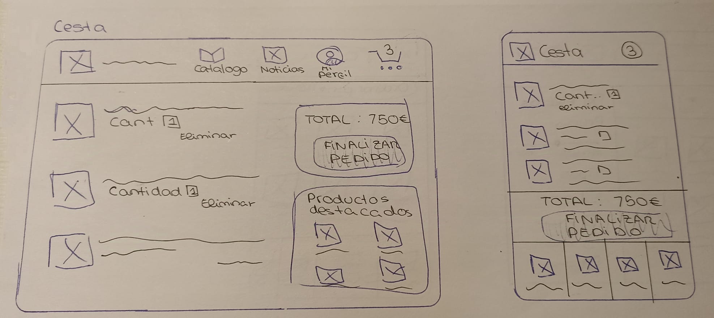
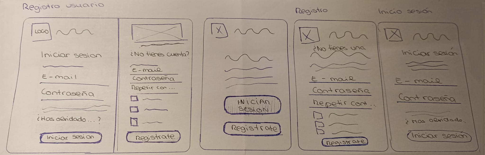
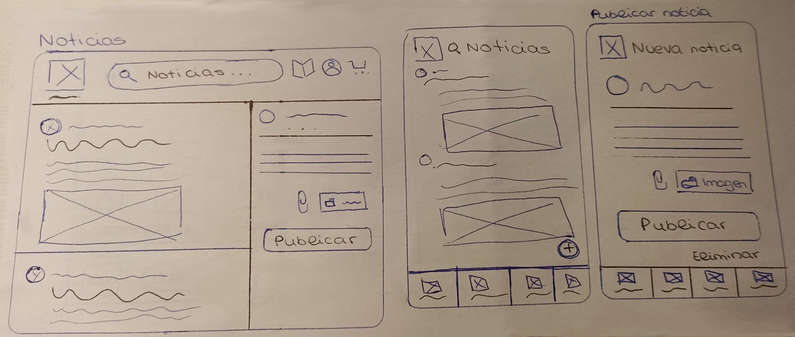

# P0_wireframe

En este proyecto, desarrollaremos un wireframe de baja fidelidad para un e-commerce dedicado a la venta de guitarras de lujo. Este trabajo se realiza en colaboración entre los módulos de DAM y DAW, ofreciendo así una visión de la aplicación tanto para ordenadores como para dispositivos móviles.

Dado que la persona de DAW en mi equipo no ha asistido a ninguna clase de este curso, he asumido la responsabilidad de realizar ambas versiones del proyecto. A continuación, presentaré las distintas pantallas, explicando brevemente la estructura y funcionalidad de cada una.

## Pagina de inicio 

Como se aprecia en la imagen de la versión para ordenador, en la parte superior de la página se encuentra un menú de navegación. A la izquierda, se ubica el logotipo de la empresa; si este no incluye el nombre de la marca, el nombre puede añadirse debajo del logo, al presionar el icono nos redigira siempre a la pantalla de inicio. En el centro del menú se encuentra un buscador con un botón que redirige al catálogo de guitarras. A la derecha, aparecen tres botones que permiten acceder a las secciones de noticias, login, y carrito de compras. Este estilo de menú se mantiene consistente en toda la web.

Debajo del menú, se muestran los productos destacados en una disposición horizontal, con una imagen de cada producto acompañada de una breve descripción.

Finalmente, al pie de la página, encontramos una sección de presentación de la tienda, que incluye información sobre "Quiénes somos", métodos de contacto para asistencia, y enlaces a las redes sociales de la empresa.

La versión móvil mantiene el mismo estilo de diseño, con la diferencia de que el menú, que incluye los botones de noticias, inicio, cesta y perfil, se encuentra en la parte inferior de la pantalla.

## Catalogo de los productos

En esta página, el menú presenta una variación: el botón de acceso al catálogo desaparece del buscador. Justo debajo del menú, se incluye un desplegable que permite ordenar los productos según varios criterios, como valoración, precio de mayor a menor y de menor a mayor. A la derecha del desplegable, se encuentra el filtro, que ofrece un rango de precios configurable para establecer el valor mínimo y máximo, además de una opción para seleccionar el tipo de guitarra. Los productos se muestran con su imagen acompañada de una breve descripción.

## Detalles del prducto 

El menú se mantiene en la parte superior. Debajo, aparece la imagenes del producto, que se puede desplazar mediante flechas. A la derecha, se muestra el nombre del producto junto con sus especificaciones, el precio y un selector de cantidad para añadir al carrito. Debajo de la imagen, se encuentran las reseñas del producto. La versión móvil incluye el mismo contenido, adaptado a un formato más vertical.

## Cesta de compra

En la sección de la cesta, el menú se mantiene visible en la parte superior, aunque sin el buscador. Debajo del menú, se ve una lista de los productos añadidos al carrito, con su imagen, nombre, cantidad, precio y una opción para eliminarlos. A la derecha, se presenta el precio total del pedido, junto con la opción de finalizar y proceder al pago. Más abajo, aparecen imágenes de productos destacados para continuar comprando si se desea.

En la versión móvil, el listado de productos y el total se mantienen; sin embargo, debido al espacio reducido, se omiten las recomendaciones de productos destacados. Aun así, siempre es posible seguir comprando desde el menú inferior.

## Registro usuario 

En la versión web para ordenador, la pantalla se divide en dos secciones. En la parte izquierda, se muestra el logotipo de la empresa junto con su nombre, seguido de los campos necesarios para iniciar sesión. En la sección derecha, se encuentran los datos requeridos para registrarse, junto con una casilla para aceptar las políticas de seguridad de la web.

En la versión móvil, la pantalla inicial incluye el logotipo de la empresa, su nombre y un breve texto introductorio. Debajo, hay dos botones que permiten elegir entre iniciar sesión o registrarse. Según la opción seleccionada, se redirige a la pantalla correspondiente, que mantiene una estructura similar a las secciones de la versión web.

## Blog y noticias

Regresamos al formato base de la web, con el menú en la parte superior. En esta pantalla, sin embargo, el buscador está diseñado para buscar noticias en lugar de productos. Debajo del menú, se muestra el listado de noticias, que sigue una estructura consistente: cada publicación incluye la foto y el nombre del usuario, el título del post y el contenido, que puede incluir texto e imágenes. A la derecha de esta sección, se encuentra el espacio para redactar nuevas publicaciones.

En la versión de aplicaición móvil, el diseño es ligeramente diferente. En la cabecera aparece el logotipo de la marca junto con el título "Noticias" y un ícono de lupa para abrir el buscador. La estructura de cada noticia se mantiene igual; para crear una nueva publicación, basta con presionar el botón de “+”, ubicado en la esquina inferior derecha, justo encima del menú. Esto abrirá la pantalla de creación de publicaciones, donde se puede agregar un título, el cuerpo de la noticia, así como insertar vínculos o imágenes, con botones para publicar o eliminar la entrada.

Es importante señalar que este es un wireframe de baja fidelidad, diseñado únicamente para ofrecer una idea básica de cómo será la aplicación. La estructura y lógica de este prototipo no representan una versión final ni del estilo visual ni de sus funcionalidades.

