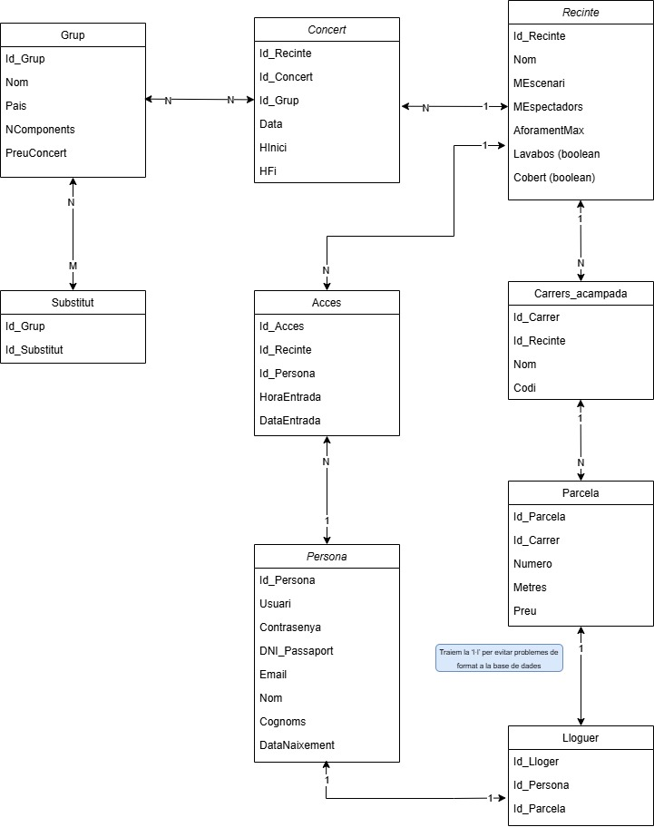

# DiSseny base de dades 

Aquest diagrama de base de dades ha estat dissenyat per gestionar un festival de música que inclou la programació de concerts, la logística dels recintes, la zona d’acampada, i la gestió dels assistents. Cada element clau del festival està representat en una taula, connectada amb relacions que permeten reflectir les interaccions entre les diferents entitats, com ara grups musicals, recintes, parcel·les d'acampada, i persones.

## Grup

Comencem per la taula Grup, que representa les bandes contractades pel festival. Per a cada grup es guarden dades com el nom, el país d’origen, el nombre de components i el preu que cobren per cada concert. Com que els grups poden cobrar diferents preus segons el concert, el preu està especificat en la taula Concert, no en Grup. Aquesta taula de concerts estableix una relació de molts a molts entre grups i concerts: un grup pot actuar en diversos concerts, i un concert pot comptar amb diversos grups. Això permet programar actuacions diverses i flexibles, adequades a les necessitats d’un gran festival.

## Concert

La taula Concert inclou informació detallada sobre cada actuació programada, com ara la data, l’hora d’inici i l’hora de finalització. Cada concert es relaciona amb un Recinte específic, de manera que aquesta taula també inclou una clau forana que apunta al recinte on tindrà lloc l'actuació. La taula Recinte guarda les característiques dels espais on es fan els concerts, com el nom del recinte, la superfície de l'escenari, la capacitat màxima, i si el recinte disposa de lavabos o si té escenari cobert. Així, un recinte pot albergar múltiples concerts, però cada concert només es fa en un recinte a la vegada.

## Substitut

Per gestionar la possibilitat que els grups no puguin actuar i hagin de ser substituïts, s’ha creat la taula Substitut, que fa de pont entre els grups originals i els grups que podrien substituir-los en cas de necessitat. Aquesta taula permet que cada grup tingui un o més possibles substituts i també que un grup pugui ser substitut d’altres grups. D’aquesta manera, es pot gestionar amb més flexibilitat la programació de concerts.

## Acces

Un aspecte crucial del festival és la gestió dels accessos dels assistents als recintes. Això es fa amb la taula Accés, que permet registrar cada entrada i sortida d’un assistent de cada recinte, amb el dia i l’hora corresponents. Aquesta taula enllaça les taules Recinte i Persona, ja que cada accés és un moviment d'una persona en un recinte. Els assistents poden entrar i sortir lliurement, i per això la relació entre Persona i Recinte a través de Accés és de molts a molts.

## Persona

La taula Persona conté les dades personals dels assistents registrats al festival, com el nom d'usuari, la contrasenya, el document d’identitat, l’email, el nom complet i la data de naixement. Aquesta informació permet gestionar els accessos i les reserves de parcel·les a la zona d’acampada, assegurant que cada assistent estigui degudament identificat.

## Carrers i parcel·les

La zona d’acampada està estructurada en carrers, que estan representats a la taula Carrers_acampada. Cada carrer té un identificador únic, un codi, i un nom (generalment un nom de grup musical famós, per fer-ho més atractiu). Els carrers es divideixen en diverses Parcel·les, cadascuna amb el seu número dins del carrer, la seva superfície i el seu preu de lloguer. Les parcel·les són gestionades de manera independent, de manera que es poden repetir números entre carrers diferents. La relació entre Carrers_acampada i Parcel·la és de tipus un a molts, ja que cada carrer pot tenir múltiples parcel·les.

## Lloguer

Cada Parcel·la pot ser llogada per un únic responsable, representat a la taula Lloguer. Aquí, es registra quina persona és responsable de cada parcel·la llogada. Per simplificar la gestió, cada persona només pot llogar una única parcel·la, i cada parcel·la només té un responsable durant el festival. Això permet identificar fàcilment qui és responsable de cada espai a la zona d’acampada, assegurant una gestió clara i ordenada.

## Diagrame base de dades 

A continuació, podem veure el disseny del diagrama de la base de dades per gestionar el festival de música. Aquest diagrama mostra les diferents taules que representen les entitats principals del festival, com els grups musicals, els recintes, les parcel·les d’acampada, els accessos dels assistents i els lloguers. Les línies que connecten les taules indiquen les relacions entre aquestes entitats, permetent una gestió coordinada dels concerts, la logística de l'espai, i el seguiment dels moviments i reserves dels assistents al festival.

